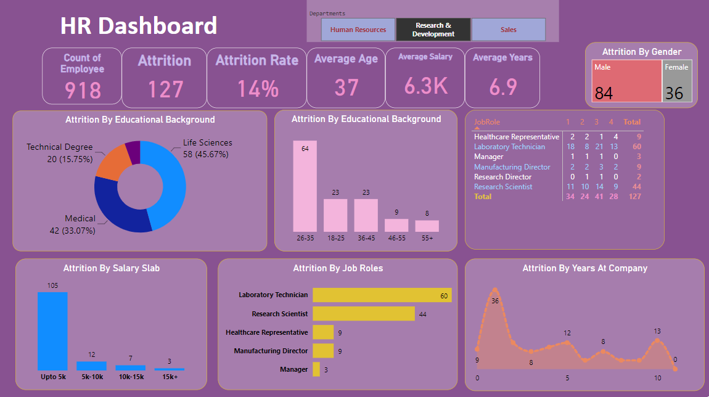

# HR Dashboard - Employee Attrition Analysis

## Overview
This project is an HR Dashboard created using Power BI to analyze employee attrition within our company. The dashboard provides valuable insights and visualizations to help HR professionals and management make informed decisions about employee retention.

## Key Features
- Interactive visualizations showing attrition trends over different criteria like salary, department, gender, etc.
- Employee demographics analysis including age, gender, and department.
- Attrition reasons breakdown.

## How to Use
1. Clone this repository to your local machine.
2. Open the HR_Dashboard.pbix file using Power BI Desktop.
3. Explore the various pages and visualizations to gain insights.
4. Customize the dashboard as needed for your specific data.

## Technologies
- Power BI
- Microsoft Excel

## Contributors
- [Abhas](https://github.com/ABHAS2022)

## Acknowledgments
- Dataset Credits: Kaggle HR Employee Attrition Dataset.
